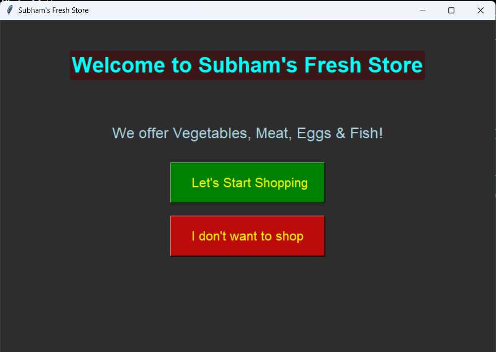
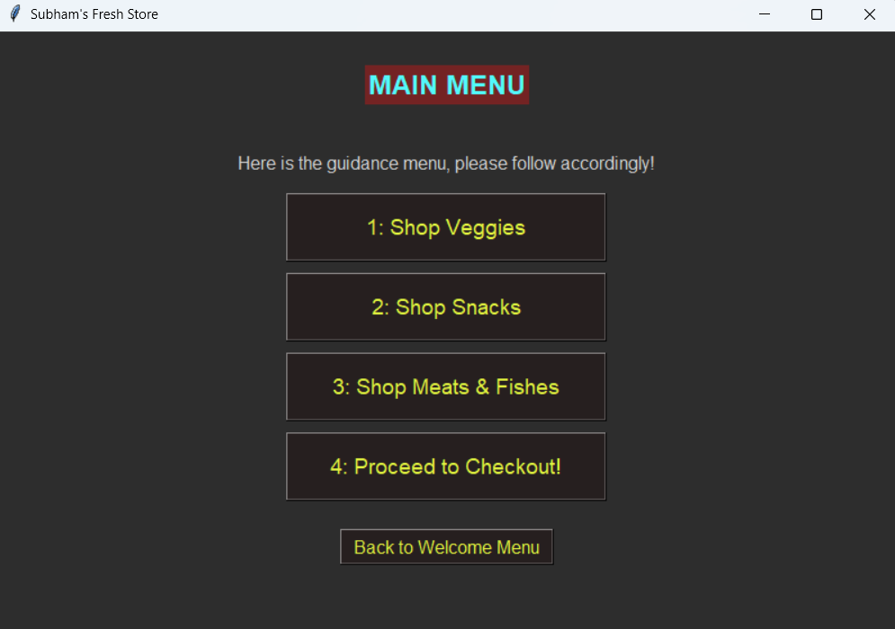
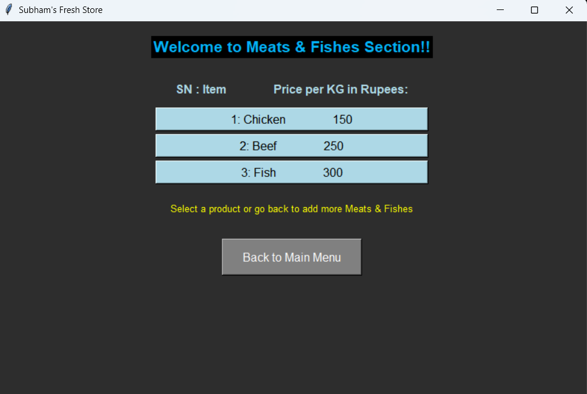
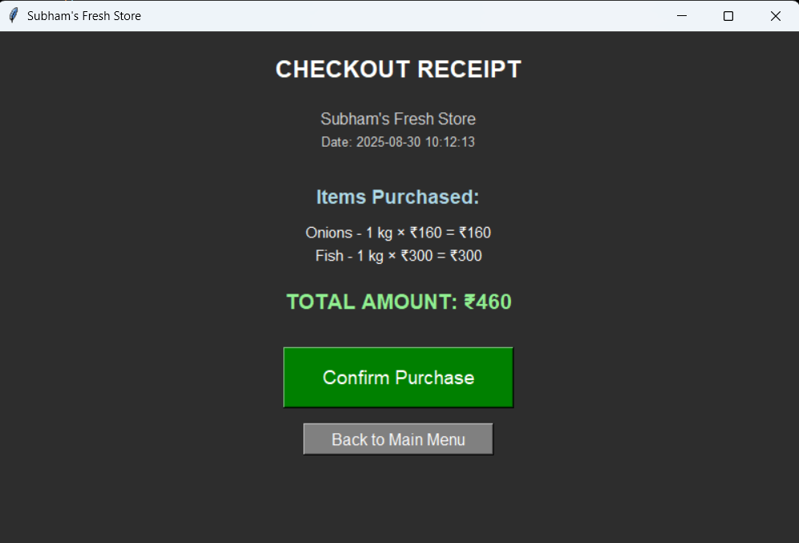

# 🛒 Subham's Fresh Grocery Store

### A Python Project by [Saksham Sharma](https://github.com/UnExplainableFish52)

> "A smart, efficient, and interactive grocery store simulation with a user-friendly GUI and full control flow – all coded in Python."

---

## ✨ Features

- ✅ Fully controlled customer navigation – from **entering** the shop to **checkout**.
- ⚙️ Implements **optimal, practical, and efficient** techniques for smooth execution.
- 🛡️ Strong **input validation** and **controlled user flow**.
- 🛍️ Complete **shopping experience in one go**.
- 🖼️ Built with **Tkinter GUI** for easier navigation and demonstration.
- 🧱 Entirely developed using **OOP principles** – classes and functions only.
- 🧠 Fine-tuned using **Claude Sonnet 4 AI** for code enhancement.

---

## 📸 Screenshot
## 📸 Screenshot






---

## 🧰 Technologies Used

- Python 3.x
- Tkinter (Python GUI Library)
- Claude Sonnet 4 (for optimization assistance)

---

## 🚀 How to Run

1. Clone the repository:
   ```bash
   git clone https://github.com/UnExplainableFish52/grocery-store-python.git
